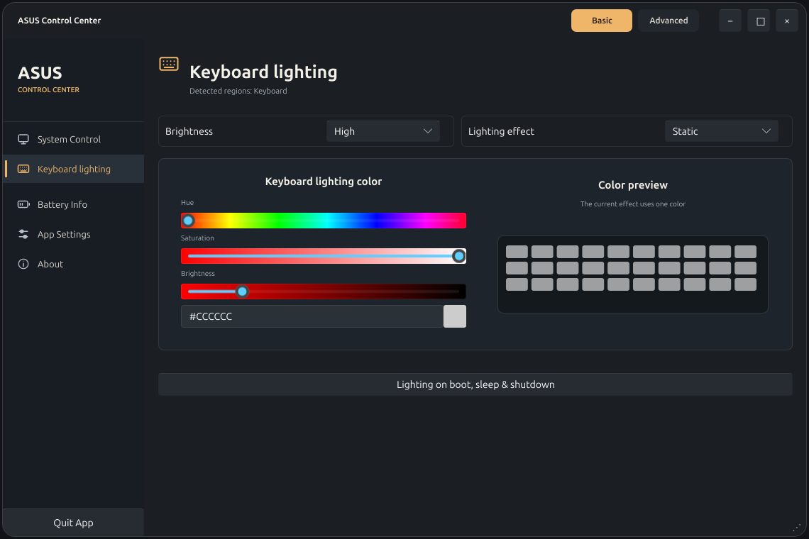
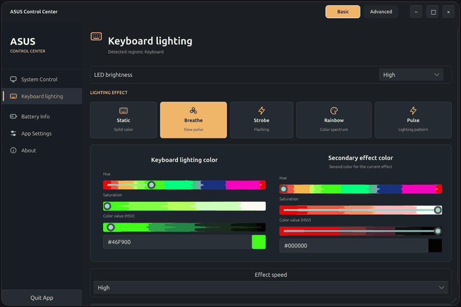
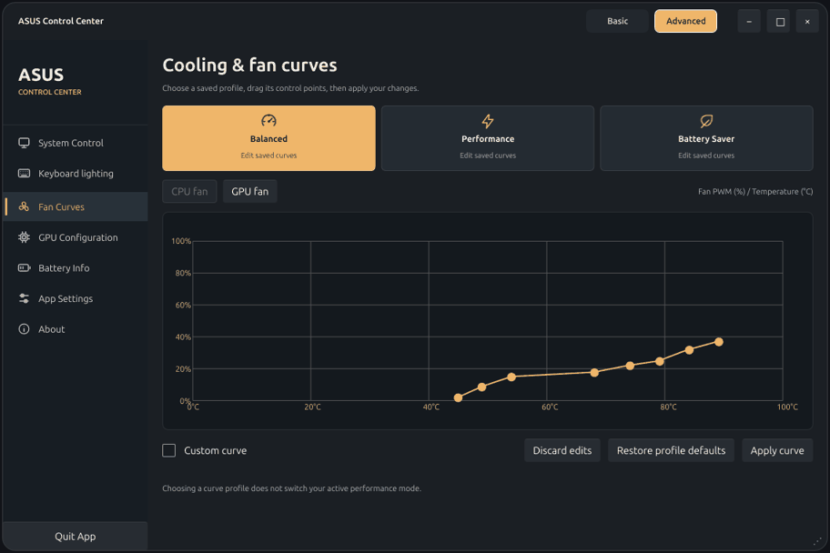
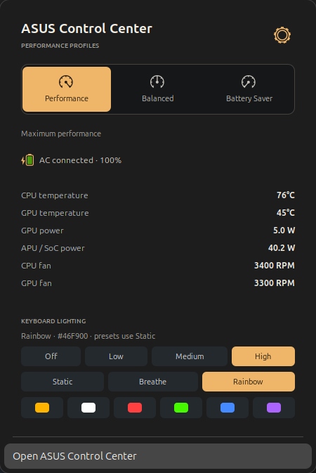
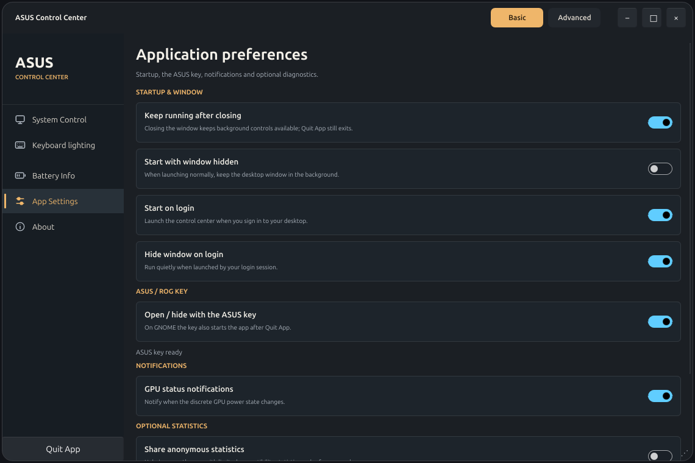
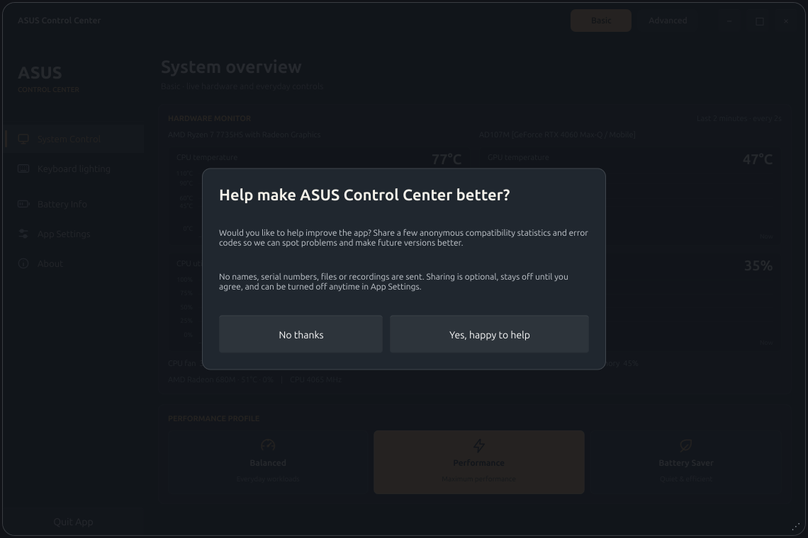
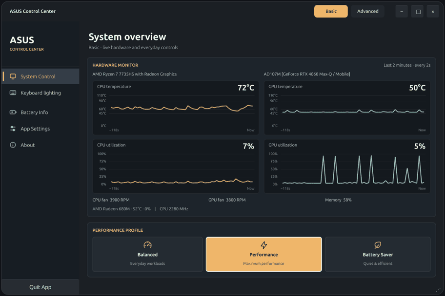
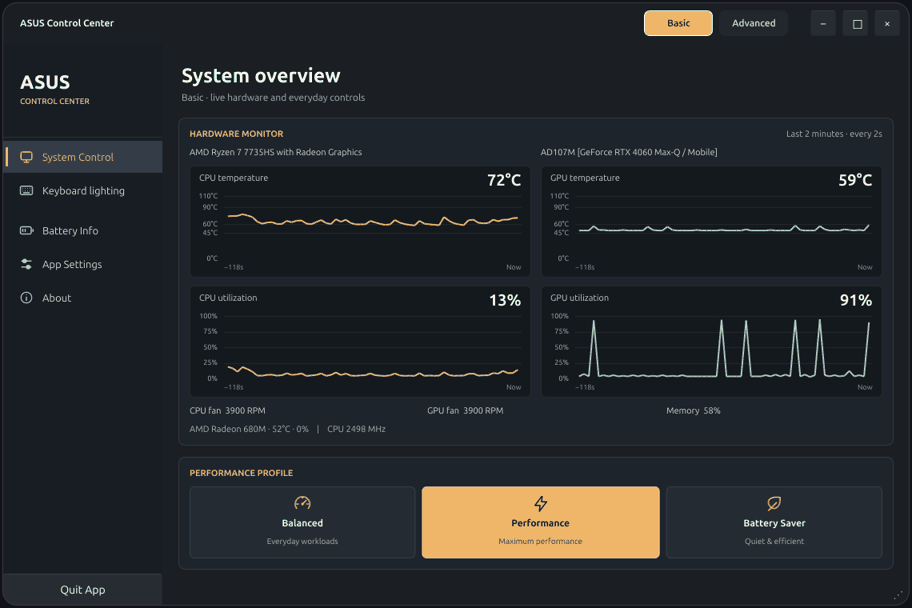
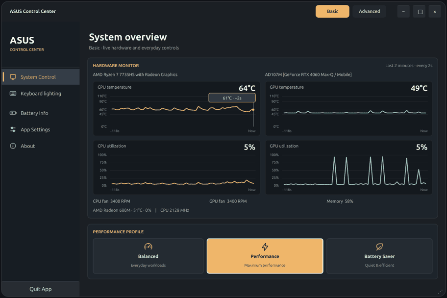
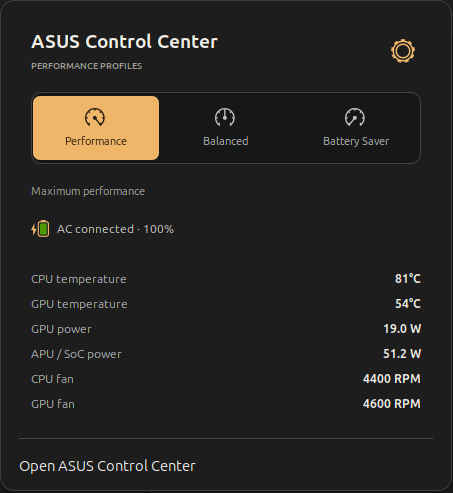

# ASUS Control Center for Ubuntu

**Performance, fan, RGB and battery controls for ASUS ROG and TUF laptops.**

A Ubuntu build of asusctl / ROG Control Center, with a GNOME panel companion for
quick profile switching and AC power notifications.


- **Three profile buttons:** Performance, Balanced and Battery Saver, with an animated selector.
- **Power-source notifications:** native GNOME notifications when the charger connects or disconnects.
- **Live telemetry:** CPU/GPU temperatures, GPU watts, APU/SoC watts and fan RPM in the panel.
- **History charts:** CPU/GPU temperature and utilization, with 60 bounded samples, labelled axes and values on hover.
- **Keyboard RGB in the panel:** brightness, Static/Breathe/Rainbow and six preset colors.
- **Hardware shortcuts:** Armoury Crate opens/hides the app; Aura cycles supported lighting effects.
- **Desktop controls:** fan curves, keyboard lighting, battery charge limits and available hardware settings.
- **Ubuntu packaging:** build a `.deb` on Ubuntu with X11 support and pinned Rust dependencies.

Battery Saver uses the ASUS Quiet profile. Hardware features depend on the laptop,
firmware and kernel. This project keeps the existing asusd policy for automatic
AC/battery switching.

## Installation

Run one installer from your desktop account:

```bash
curl -fsSL https://raw.githubusercontent.com/hlstrk/asus-control-center-ubuntu/v1.6.0/scripts/install.sh -o /tmp/asus-control-install.sh && sudo bash /tmp/asus-control-install.sh
```

It downloads and verifies the versioned Ubuntu package, installs it with apt and
adds the panel to your own account. On X11, restart the shell with Alt+F2 → `r` →
Enter. On Wayland, sign out and back in when ready. It does not reboot the laptop.

The installer checks Ubuntu 22.04 / 24.04 / 26.04 LTS, amd64 architecture,
ASUS manufacturer/model, free space, existing installations and package dependencies.
It selects the GNOME 42 legacy panel or the GNOME 46/50 modern panel. Other desktops
can install the GUI with `--no-panel`; a desktop environment is never installed for you.

Read-only checks (no sudo required):

```bash
bash /tmp/asus-control-install.sh --check
```

Every run writes a **private local debug log**. Nothing is uploaded, no environment
or serial-number dump is collected, and paths/IP/token-like values are masked.
User checks log under `~/.local/state/asus-control-center/install-logs`; sudo installs
log under `/var/log/asus-control-center`. The installer does not launch the GUI or
send development statistics. It does not upgrade your OS, kernel or NVIDIA driver.

The portable package is built on Ubuntu 22.04’s glibc baseline. Its ABI is checked
when packaging and again before installation; incompatible packages are refused.
Hardware controls still depend on the laptop and kernel. See the exact validation
scope before treating another laptop/desktop as tested.

[Packages](packages/v1.6.0) · [Illustrated guide](docs/INSTALL.md) ·
[Compatibility and checks](docs/COMPATIBILITY.md)

## Basic and Advanced

**Basic** keeps live monitoring, profiles, keyboard lighting, battery limits and
application information. **Advanced** additionally exposes fan curves, graphics
mode, ASUS power limits and detailed power policy. The mode tabs are in the title bar.

The desktop has a subtly translucent surface and rounded custom chrome. Text stays
opaque. You can drag the title bar, resize from the bottom-right corner and use the
minimize/maximize/close buttons. New windows open centered on the active monitor.
The icon sidebar supports keyboard navigation and animated page changes; GNOME’s
reduced-motion setting disables these transitions. The panel gear opens the desktop controls.

## GPU monitoring

Version 1.2.0 fixes AMD APU identification when the internal connector is `eDP-2`
or when a MUX routes the display differently. Sensor readings are collected from
the detected device rather than a hard-coded DRM card number. [AMD/NVIDIA GPU guide](docs/GPU.md).

## Lighting that matches your laptop

The lighting page names firmware-reported regions: keyboard, front lightbar,
rear lighting or lid LEDs. It displays only the available effects and region,
speed and direction controls. LED brightness is separate from the color’s HSV value. Icon effect tiles
switch the controls below: one color for Static, two for Breathe, and only
supported speed/direction controls for color-independent effects.
Boot/sleep/shutdown settings retain the device’s supported power behavior.





## Cooling and settings

Advanced → Fan Curves has separate profile and CPU/GPU selectors. Dragging a
point edits a draft; **Apply curve** writes it, while **Discard edits** reloads
the saved curve. Selecting a curve profile does not change the running profile.
Unsupported fans are hidden.



App Settings groups startup, window behavior, ASUS key, notifications and optional
statistics. On GNOME 46 the ASUS/ROG key uses a native custom shortcut, so it can
open the app after Quit App as well as hide or restore an existing window.
Existing custom shortcuts are preserved; conflicting assignments are reported.
The Aura key cycles available lighting effects. Color presets in the panel select
Static; changes are written through the existing local ASUS daemon.





## Optional statistics

The first launch asks before sending anything. **Keep off** sends no reports;
the choice can be changed in App Settings. With permission, the development statistics service receives up
to three compatibility reports per day and up to five fixed error codes. Reports
contain software version, desktop/session type and CPU/GPU vendor categories.
They exclude names, serial numbers, hardware IDs, file paths, recordings and raw
logs. A random installation ID makes reports pseudonymous rather than identifying
your hardware. Normal HTTP infrastructure still handles your connection IP.



[Exact fields, retention and API protections](docs/PRIVACY.md)

## In action

**Sidebar navigation**



**Basic / Advanced navigation**


**Direct performance profiles**



**Live hardware history**

Move over a chart to see the recorded value and its age. Temperatures have °C
scales; utilization has a percentage scale. No reading is interpolated or filled
with zero when a sensor is missing.



The desktop samples while its window is visible. The panel reads independently,
so its readings continue after Quit App. Missing sensors display N/A; APU/SoC
power is not labelled as wall power or isolated iGPU power. Sleeping NVIDIA GPUs
are skipped rather than awakened for a reading.



## Screenshots

| Balanced | Battery Saver |
| --- | --- |
|  |  |


Power-source notifications appear automatically when AC state changes.

## Development

```bash
gjs -m tests/profiles.js
python3 tests/telemetry_test.py
bash -n scripts/*.sh
```

[Validation](docs/VALIDATION.md) · [Design notes](docs/DESIGN.md) · [Contributing](CONTRIBUTING.md) · [License](LICENSE)

## Maintainer

Ubuntu edition and GNOME panel by **Halis Türk ([hlstrk](https://github.com/hlstrk))**.

## Credits

Based on [asusctl 6.5.0](https://github.com/OpenGamingCollective/asusctl) by the
ASUS Linux / OpenGamingCollective contributors. Original source and notices are
preserved in `vendor/asusctl`. The desktop interface uses [Slint](https://slint.dev).
See [NOTICE](NOTICE) for attribution and distribution details.

Independent community project; not an official ASUS application.
