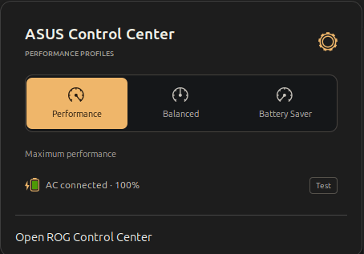
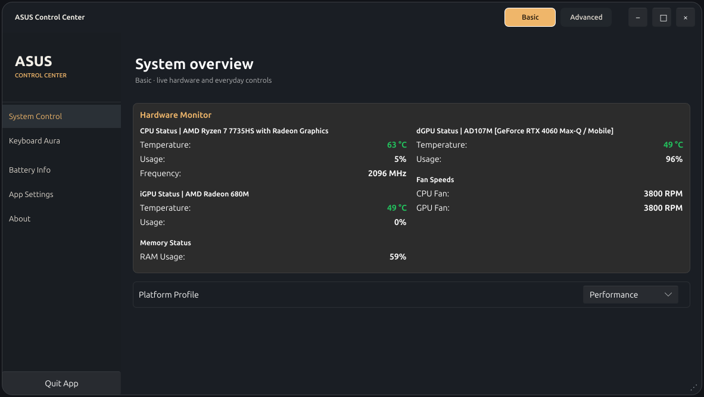
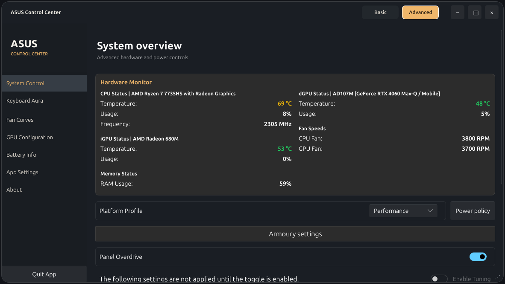
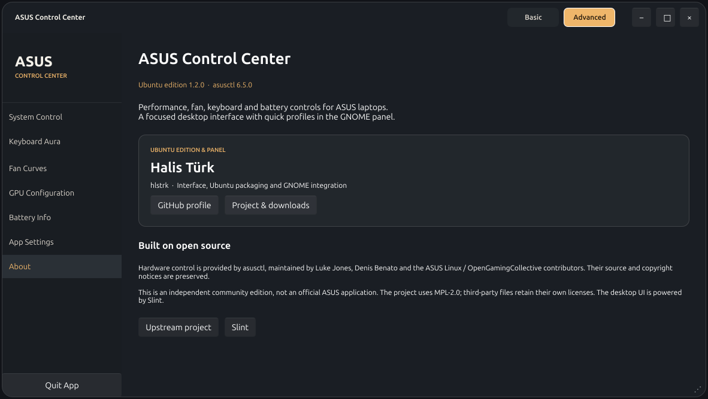
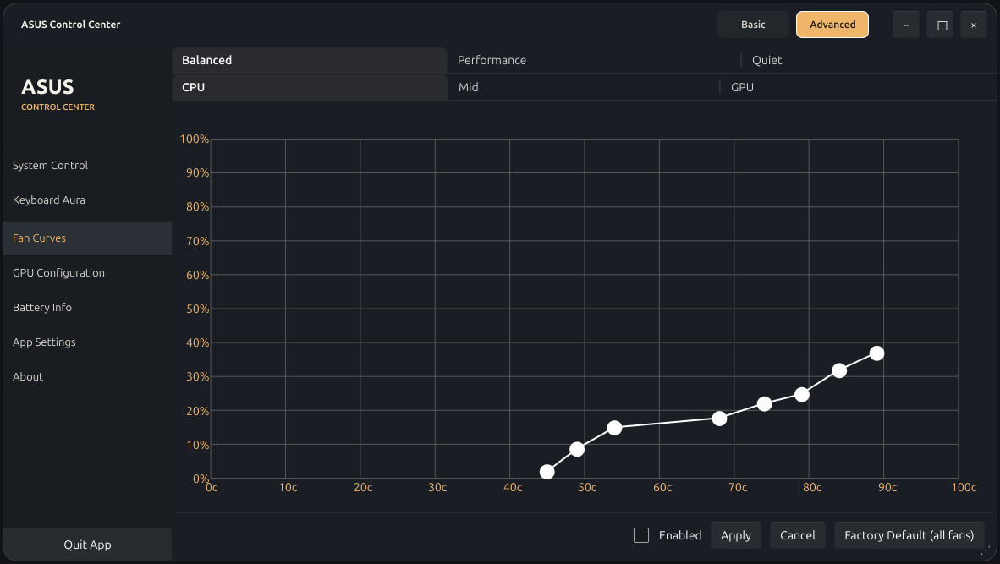

# ASUS Control Center for Ubuntu

**Performance, fan, RGB and battery controls for ASUS ROG and TUF laptops.**

A Ubuntu build of asusctl / ROG Control Center, with a GNOME panel companion for
quick profile switching and AC power notifications.



- **Three profile buttons:** Performance, Balanced and Battery Saver, with an animated selector.
- **Power-source notifications:** native GNOME notifications when the charger connects or disconnects.
- **Desktop controls:** fan curves, keyboard lighting, battery charge limits and available hardware settings.
- **Ubuntu packaging:** build a `.deb` on Ubuntu with X11 support and pinned Rust dependencies.

Battery Saver uses the ASUS Quiet profile. Hardware features depend on the laptop,
firmware and kernel. This project keeps the existing asusd policy for automatic
AC/battery switching.

## Installation

Run one installer from your desktop account:

```bash
curl -fsSL https://raw.githubusercontent.com/hlstrk/asus-control-center-ubuntu/v1.2.0/scripts/install.sh -o /tmp/asus-control-install.sh && sudo bash /tmp/asus-control-install.sh
```

It downloads and verifies the versioned Ubuntu package, installs it with apt and
adds the panel to your own account. On X11, restart the shell with Alt+F2 → `r` →
Enter. On Wayland, sign out and back in when ready. It does not reboot the laptop.

The `.deb` remains useful: apt tracks installed files, upgrades and removal, while
the script handles the per-user panel setup. You do not need to download it manually.
[Packages](packages/v1.2.0) · [Illustrated guide](docs/INSTALL.md) · [Source build](docs/INSTALL.md#build-from-source)

## Basic and Advanced

**Basic** keeps live monitoring, profiles, keyboard lighting, battery limits and
application information. **Advanced** additionally exposes fan curves, graphics
mode, ASUS power limits and detailed power policy. The mode tabs are in the title bar.

The desktop has a subtly translucent surface and rounded custom chrome. Text stays
opaque. You can drag the title bar, resize from the bottom-right corner and use the
minimize/maximize/close buttons. The panel gear opens the desktop controls.

## GPU monitoring

Version 1.2.0 fixes AMD APU identification when the internal connector is `eDP-2`
or when a MUX routes the display differently. Sensor readings are collected from
the detected device rather than a hard-coded DRM card number. [AMD/NVIDIA GPU guide](docs/GPU.md).

## Screenshots

| Balanced | Battery Saver |
| --- | --- |
|  |  |










## Development

```bash
gjs -m tests/profiles.js
bash -n scripts/*.sh
```

[Validation](docs/VALIDATION.md) · [Design notes](docs/DESIGN.md) · [Contributing](CONTRIBUTING.md) · [License](LICENSE)

## Maintainer

Ubuntu edition and GNOME panel by **Halis Türk ([hlstrk](https://github.com/hlstrk))**.

## Credits

Based on [asusctl 6.5.0](https://github.com/OpenGamingCollective/asusctl) by the
ASUS Linux / OpenGamingCollective contributors. Original source and notices are
preserved in `vendor/asusctl`. The desktop interface uses [Slint](https://slint.dev).
See [NOTICE](NOTICE) for attribution and distribution details.

Independent community project; not an official ASUS application.
