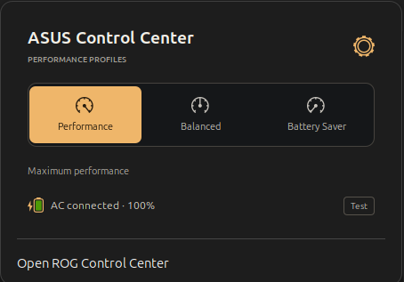
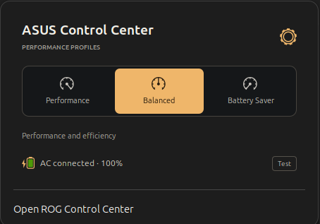
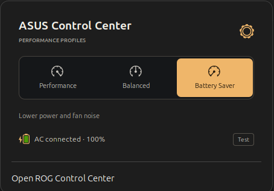
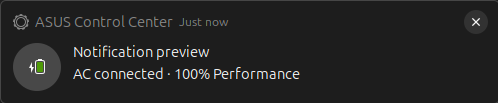

# Install on Ubuntu 24.04

The verified system is an ASUS TUF A15 FA507NV running GNOME Shell 46, X11,
and kernel 7.0.0-31-generic. The upstream recommendation is Linux 6.19 or newer.
Other ASUS models expose different controls; this is not a promise of universal support.

## 1. Install the desktop controls

Download the [Ubuntu package](../packages/v1.0.1/asus-control-center_1.0.1_amd64.deb)
and compare it with [SHA256SUMS](../packages/v1.0.1/SHA256SUMS). Save the package
in Downloads, then install it:

```bash
sudo apt install ~/Downloads/asus-control-center_1.0.1_amd64.deb
systemctl is-active asusd
asusctl info
```

This installs the daemon, CLI and desktop app. It does not replace your kernel,
NVIDIA driver, or nvidia-powerd configuration. The daemon starts automatically.

## 2. Add the top-panel selector

```bash
asus-control-panel-install
```

On **X11**, press **Alt+F2**, type **r**, then press Enter. On **Wayland**, sign
out and sign in; save your work before signing out. Other panel extensions are preserved.



Click **ASUS** in the upper panel to open the three profile buttons.





Battery Saver maps to the ASUS **Quiet** profile. Changing it selects the current
profile; it does not overwrite your saved AC and battery policy. The existing
asusd policy may select a different profile when the adapter is connected or removed.

## 3. Power notifications

The panel checks power supplies every two seconds. Two consistent changed samples
confirm a plug/unplug transition. GNOME presents a notification with the power source,
battery percentage and current profile. Do Not Disturb and notification settings
still apply. A startup notification is intentionally omitted. The **Test** button
in the panel previews the notification without changing the power state.



## Build from source

Install the compiler dependencies:

```bash
sudo apt install build-essential cmake pkg-config libudev-dev libusb-1.0-0-dev \
  libfontconfig1-dev libxkbcommon-dev libxkbcommon-x11-dev libwayland-dev gettext \
  python3-gi gjs
```

Install Rust using the official instructions at https://rustup.rs, then:

```bash
git clone https://github.com/hlstrk/asus-control-center-ubuntu.git
cd asus-control-center-ubuntu
rustup toolchain install 1.93.0 --profile minimal
./scripts/build.sh
```

The build retains Cargo.lock and explicitly enables X11 support. Source is vendored
under `vendor/asusctl` so the release's desktop changes are available with its binaries.
The output is in `dist/`; the extension ZIP and SHA256SUMS are generated alongside it.

## Checks and troubleshooting

```bash
gjs -m tests/profiles.js
systemctl status asusd
asusctl profile get
gnome-extensions info asus-control-center@hlstrk
```

If the selector does not appear after installation, check GNOME 46 compatibility and
restart the X11 shell or sign in again on Wayland. If profile switching fails, inspect
`journalctl -u asusd` and confirm your account has permission to use the daemon.
Read-only kernel status remains visible even when the daemon is stopped.

Remove the panel with `asus-control-panel-remove`. Remove the desktop package
with `sudo apt remove asus-control-center` if desired. Keep a copy of `/etc/asusd`
if you want to preserve your profiles before making further configuration changes.
